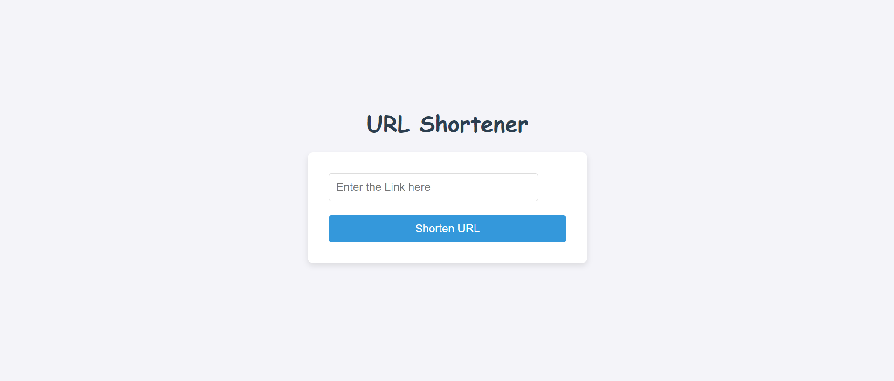

# URL Shortener Project

## Overview

This project is a URL shortener application built with Next.js, allowing users to shorten and manage URLs. It includes features like URL shortening, QR code generation, URL editing, and redirection.

## Features

- Shorten long URLs
- Generate QR codes for shortened URLs
- Edit and manage shortened URLs
- Redirect users to the original URL

## Screenshots

Below are some screenshots of the website:

### Home Page


### URL Shortening Form


### QR Code Generation


### URL Management


## Installation

1. Clone the repository:
   ```bash
   git clone <your-repository-url>
